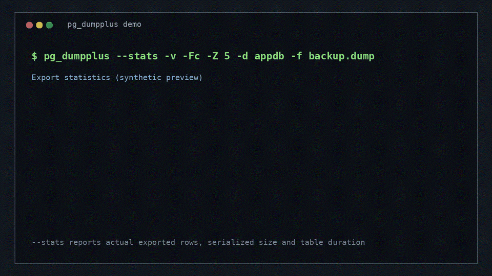

# pg_dumpplus — PostgreSQL dump filtering and masking

**A PostgreSQL `pg_dump`-compatible client for row filtering, column masking,
and controlled data exports.**

[](https://github.com/senhakan/pgdumpplus/releases/latest)
[](LICENSE)

[Download](https://github.com/senhakan/pgdumpplus/releases/latest) · [Türkçe](docs/pgdumplus-tr.md) · [Report an issue](https://github.com/senhakan/pgdumpplus/issues)

See [CHANGELOG.md](CHANGELOG.md) for release history and migration notes.

`pg_dumpplus` extends PostgreSQL's `pg_dump` with **row-level filtering**,
**column-level masking**, and **export statistics**. Its selective-export
workflow is intentionally close to the practical parts of Oracle Data Pump
`expdp`: choose table rows, transform selected columns during export, and see
what each completed table actually produced—while retaining PostgreSQL dump
formats and standard restore tools.

```bash
pg_dumpplus -d mydb -Fc \
  --where="public.orders:created_at >= now() - interval '30 days'" \
  --mask='public.customers:email:all' \
  --mask='public.customers:phone:phone' \
  -f export.dump
```

This exports the database with only the last 30 days of orders and the specified
customer columns masked. Other tables and columns are exported normally.

### See it in action

The profile workflow keeps row filtering and column masking in one repeatable
command:


The animation is a synthetic preview; use the matching PostgreSQL-major client
for your database and review the restored dump before sharing it.

## Why pg_dumpplus?

- **Choose rows, not just tables.** Add SQL conditions with `--where`, similar
  to Oracle Data Pump's `QUERY` option.
- **Mask as you export.** Use built-in presets or your own SQL expressions.
- **Measure each export.** Use `--stats` to report actual exported rows,
  serialized size, and table duration as each table completes.
- **Keep your workflow.** Custom (`-Fc`), plain SQL (`-Fp`), directory (`-Fd`),
  parallel dumps (`-j`), and `--inserts` are supported.
- **Keep a consistent snapshot.** Filtering and masking run inside the dump's
  snapshot, without a separate export step.

pg_dumpplus installs as a separate command alongside your existing PostgreSQL
tools. It is an independent project based on PostgreSQL's `pg_dump`.

In CI, an unfiltered `pg_dumpplus` export is restored and compared with a
matching vanilla `pg_dump` export. The intentional difference begins only when
`--where` or `--mask` rules are supplied: PostgreSQL object selection remains
`pg_dump`-compatible, while row and column values are transformed during data
export.

### Common use cases

- Export only one tenant, customer, date range, or business partition.
- Create staging and QA dumps with selected email, phone, address, or payment
  fields replaced before export. This is partial masking, not anonymization or
  a compliance guarantee.
- Produce support extracts while keeping PostgreSQL's custom, plain, and directory formats.
- Run repeatable, scriptable exports in CI/CD and operational tooling.

## Install

Choose a Linux **x86_64** package from the
[latest release](https://github.com/senhakan/pgdumpplus/releases/latest).

| Platform | Package |
| --- | --- |
| RHEL / Rocky Linux / AlmaLinux 8 | `.el8.x86_64.rpm` |
| RHEL / Rocky Linux / AlmaLinux 9 | `.el9.x86_64.rpm` |
| RHEL / Rocky Linux / AlmaLinux 10 | `.el10.x86_64.rpm` |
| Ubuntu 22.04 | `*_u2204_amd64.deb` |
| Ubuntu 24.04 | `*_u2404_amd64.deb` |
| Debian 12 | `*_d12_amd64.deb` |

Packages are available for PostgreSQL 13 (legacy) and 14 through 18
(maintained). Choose the matching major version for your server.
Do not use a client older than your server's major version.

For complete Ubuntu/Rocky package installation, verification, dump, profile,
restore and removal examples, see the [Turkish installation and usage manual](docs/manual-tr.md).

### Automated installer

The installer detects the supported OS and PostgreSQL major version, selects the
matching release package, reports an existing installation, asks for
confirmation, installs it, and verifies the binary. Review the script before
running it; add `--yes` for non-interactive automation:

```bash
curl -fsSL https://github.com/senhakan/pgdumpplus/releases/latest/download/install-pgdumpplus.sh \
  | bash -s --

# wget equivalent
wget -qO- https://github.com/senhakan/pgdumpplus/releases/latest/download/install-pgdumpplus.sh \
  | bash -s -- --yes

# Explicit PostgreSQL major when automatic server detection is unavailable
curl -fsSL https://github.com/senhakan/pgdumpplus/releases/latest/download/install-pgdumpplus.sh \
  | bash -s -- --pg-major 17
```

On RPM-based installations, the installer also checks PostgreSQL's standard
versioned paths (such as `/usr/pgsql-13/bin`) and queries the `postgres` service
account, so root's `PATH` does not need to contain `psql`. Use `--pg-major` only
when the server is not running or automatic detection is intentionally bypassed.

The release-asset URL is intentionally stable and shorter than a raw source
URL. The script remains versioned in the repository at
[`scripts/install-pgdumpplus.sh`](scripts/install-pgdumpplus.sh).

Use `--dry-run` to inspect the detected OS, PostgreSQL major, selected asset,
and currently installed package without downloading or changing the system.

For example, install the PostgreSQL 17 package for Ubuntu 24.04:

```bash
sudo apt install ./pgdumpplus-17_<version>-<revision>u2404_amd64.deb
pg_dumpplus --version
# Verify the project, upstream and source identity embedded in the binary
pg_dumpplus --build-info
```

For an RPM package, use `sudo dnf install ./<package.rpm>`. Packages contain
precompiled clients and a private `libpq`; no compiler, Python, or PostgreSQL
server installation is required. The package manager installs runtime libraries.
The future signed APT/RPM channel contract is documented in
[`docs/distribution.md`](docs/distribution.md); until a hosted channel is
independently verified, use the signed standalone release assets.

| Command | Purpose |
| --- | --- |
| `pg_dumpplus-18` … `pg_dumpplus-13` | Use a specific client major |
| `pg_dumpplus` | Default command supplied by the PostgreSQL 18 package |
| `pg_restoreplus-18` … `pg_restoreplus-13` | Matching archive restore client |

`--build-info` prints the pg_dumpplus project version, the upstream PostgreSQL
version and the source commit used for that build.

Profile files use the strict v1 JSON contract in
[`docs/design/profile-schema.json`](docs/design/profile-schema.json). Compiled
clients accept `--profile=FILE`, merge its rules with CLI rules, and parse it
locally without a Python runtime. Design examples for tenant subsets, support
extracts and full redaction are in
[`docs/examples/profiles/`](docs/examples/profiles/).
The client and build-time contract checker (`scripts/validate_profile.py`) reject
duplicate keys, unknown fields and malformed profile entries without external
Python packages.

A single profile can define both row filters and column masking rules:

```json
{
  "schema_version": 1,
  "filters": [
    {"table": "public.orders", "where": "id <= 25"}
  ],
  "masks": [
    {"table": "public.customers", "column": "phone", "preset": "phone"},
    {"table": "public.customers", "column": "address",
     "expression": "left(address, 3) || '***'"}
  ]
}
```

Run it with `pg_dumpplus --profile=profile.json ...`. Profile and command-line
rules may be combined; filters are applied together and duplicate mask targets
are rejected. Profile SQL expressions are trusted input, so protect the file
with the same access controls as your database credentials. The upstream
PostgreSQL `--filter=FILE` option is a separate feature and does not define
pg_dumpplus masking rules.

### Five-minute first export

1. Install the package matching the PostgreSQL server major version.
2. Copy a profile from [`docs/examples/profiles/`](docs/examples/profiles/) and
   edit its table, filter, and mask rules.
3. Run `pg_dumpplus-18 --dbname=app --profile=profile.json -Fc -f export.dump`.
4. Restore into a disposable database with the matching `pg_restoreplus-18` and
   inspect the filtered and masked values before distributing the dump.

Practical, synthetic release-binary examples are in
[`docs/tutorials.md`](docs/tutorials.md); a non-published announcement draft is
kept in [`docs/launch-draft.md`](docs/launch-draft.md).

All supported majors can be installed together. Files live under
`/opt/pgdumpplus/<major>/`, with command links in `/usr/bin/`. System `pg_dump`
and `pg_restore` commands are unchanged. Removing PG18 removes the unversioned
command; other versioned clients remain available if installed.

Tarballs use the same `opt/` and `usr/` layout and can also be extracted into a
private directory. Run `<directory>/usr/bin/pg_dumpplus-17` from there. Choose
the archive for your OS; its runtime libraries must be installed separately.

### Verify a release

Release assets include `SHA256SUMS.txt`, `SBOM.spdx.json`, and a GitHub build
attestation. Verify downloaded bytes before installation:

```bash
sha256sum --check SHA256SUMS.txt
```

Use GitHub's Artifact attestations verification for provenance; checksums verify
integrity, not build origin.

## Filter rows

Pass a table pattern and a SQL condition, without the `WHERE` keyword:

```bash
pg_dumpplus -d mydb -Fc \
  --where='public.orders:tenant_id = 42' \
  --where='public.order_items:order_id IN (SELECT id FROM public.orders WHERE tenant_id = 42)' \
  -f tenant.dump
```

Repeat `--where` for different tables. Patterns follow `pg_dump -t` syntax,
including `public.orders` and `public.*`. Tables without a matching filter are
exported in full; use `-t` to limit which tables are included.

For example, export the 1,000 most recent orders by ID:

```bash
pg_dumpplus -d mydb -t public.orders -Fc \
  --where='public.orders:id IN (SELECT id FROM public.orders ORDER BY id DESC LIMIT 1000)' \
  -f recent_orders.dump
```

## Mask columns

Preview a catalog-only masking plan without reading table rows or creating a dump:

```bash
pg_dumpplus -d mydb --dry-run --plan-format=json \
  --mask='public.customers:email:email'
```

`--dry-run` writes only the plan to standard output. JSON uses
`schema_version: 1`; custom masking SQL is reported but not executed.

Use `--mask='table:column:expression'` for each column to replace:

```bash
pg_dumpplus -d mydb -Fc \
  --mask='public.customers:full_name:all' \
  --mask='public.customers:phone:phone' \
  --mask="public.customers:email:'redacted@example.com'" \
  -f masked.dump
```

| Preset | Behavior | Example |
| --- | --- | --- |
| `all` | Replace characters with `*` | `Alice` → `*****` |
| `identity` | Keep the first two and last two characters | `12345678901` → `12*******01` |
| `phone` | Keep the last three characters | `05551234567` → `********567` |
| `email` | Keep the first character and domain | `user@example.com` → `u***@example.com` |
| `name` | Keep the first character | `Alice Smith` → `A**********` |
| `address` | Mask the complete value, preserving length | `Main Street 1` → `*************` |
| `iban` | Keep the first four and last four characters | `DE89370400440532013000` → `DE89**************3000` |
| `card` | Keep the last four characters | `4111111111111111` → `************1111` |
| `uuid` | Keep the first eight and last four characters | `550e8400-e29b-41d4-a716-446655440000` → `550e8400**********************0000` |

Custom expressions are evaluated by PostgreSQL. Their results must fit the
destination column's type and constraints. Presets return text. You can combine
`--where` and `--mask` in the same dump.

Presets preserve NULL values and empty strings. `identity` fully masks values of
four characters or fewer. `tc` remains a backwards-compatible alias for
`identity`.

**Mask rules are validated before data export.** A missing, dropped, generated,
excluded, duplicate, or type-incompatible mask fails the command. Discard any
partial output after a failure. Masking only affects the specified columns; it
does not automatically anonymize the database.

Presets are character-based transformations; they do not validate email, IBAN,
card or other business formats. They require a directly text-compatible column;
for a text domain or another constrained type, use a custom expression with an
explicit cast and test the result against your constraints.

Partitioned tables require selecting the partition hierarchy consistently. A
mask that targets a partition child excluded by the table selection fails
explicitly; it is never silently ignored.

## Export statistics

Add `--stats` to print completed table-export statistics on stderr. The line
reports actual exported rows, uncompressed serialized data size and elapsed
table duration; it does not pre-count or run a second query:

```text
pg_dumpplus: table "public.orders": rows=125438, size=84.00 MB, duration=2m 14s
```

Sizes use binary units (`B`, `KB`, `MB`, `GB`, `TB`). Schema, index, sequence
and other metadata entries do not produce table statistics.

Animated synthetic example:



The preview shows the `expdp`-style operational feedback available through
`--stats`; it contains no real database or production timings.

## Restore

Restore a custom or directory archive into an existing empty database:

```bash
pg_restoreplus-17 -d destination --no-owner export.dump
```

For a plain SQL dump, use `psql -X -v ON_ERROR_STOP=1 -d destination -f export.sql`.
The matching restore client is included. Standard `pg_restore` also works if
its version is compatible with the dump.

## Things to know

- Filters do not automatically include related rows. Keep referenced parent
  records when filtering tables connected by foreign keys.
- Masking primary, unique, or foreign key columns can break constraints.
- Selecting tables with `-t` does not automatically include all dependencies,
  such as their schemas. Prepare these on the destination when needed.
- An unmatched table pattern or invalid SQL causes the dump to fail.

## Feedback and contributions

Have a use case, feature idea, or bug to report?
[Open an issue](https://github.com/senhakan/pgdumpplus/issues). Include your
PostgreSQL version and a minimal example with sensitive data removed.
Pull requests are welcome.

## License

[PostgreSQL License](LICENSE).
